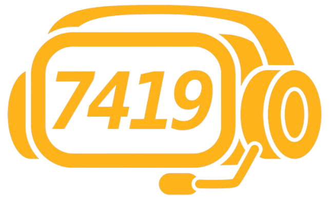

# Team 7419 Tech Support

**The Future of Innovation**  
A student-led competitive robotics team pushing the boundaries of innovation, engineering excellence, and technical education at The Quarry Lane School.

## Our Mission

Team 7419 QLS Tech Support instills technical expertise and collaboration in every member. We are a supportive family, giving back to the community with skills honed through FIRST Robotics. Every day, we work hard to become the leaders of tomorrow.

## About Us

Team 7419 is a dedicated group of high school students from [The Quarry Lane School](https://www.thequarrylaneschool.com) in Dublin, CA. Founded in 2018 by passionate students and teachers, we have competed at world championships three times and continue to grow year after year.

### What We Do

- **Competitive Robotics:**  
  We design, build, and program robots for the FIRST Robotics Competition.  
  - **Programming:** Our team uses Java to develop complex behaviors and autonomous routines.  
  - **Mechanical Engineering:** We fabricate custom robot parts with CNC machines and manual mills.  
  - **Electrical Engineering:** We integrate control systems, sensors, and more to bring our robots to life.

## Our Values

- **Teamwork:**  
  Mentor-driven yet student-organized, we support and elevate each other while holding ourselves accountable.
  
- **Community:**  
  Through outreach and mentoring, we share our skills and inspire younger students to engage with STEM.

## Contact

Have questions? Reach out to us through our email [qls7419leadership@gmail.com](mailto:qls7419leadership@gmail.com).

*Together, we are shaping the future of robotics and technical education.*

